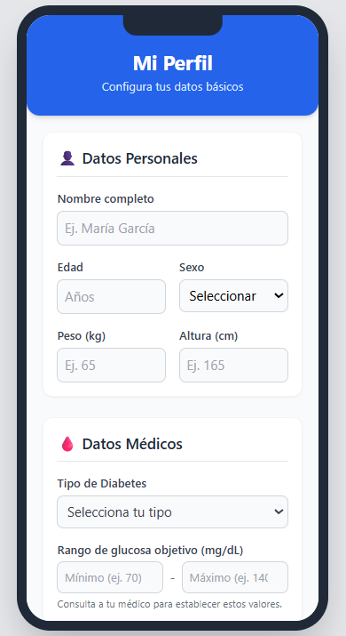
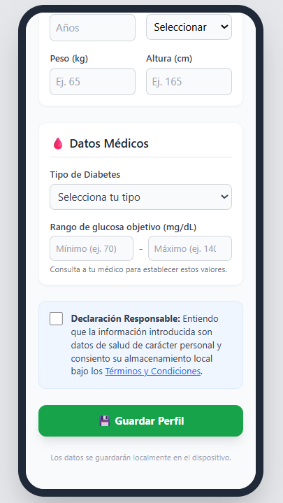

<h1 align="center"> 📖 Manual de Usuario - App Diabetes</h1>
Bienvenido al manual de usuario oficial. Este documento está diseñado para ayudar a los pacientes y especialistas a entender el funcionamiento básico de nuestra aplicación móvil.

<h2 align="center"> 1. Pantalla de Inicio </h2>
Al abrir la aplicación, el usuario se encontrará con un panel de control muy intuitivo. 

   
   

<h2 align="center"> 2. Registro de Mediciones</h2>
Para registrar un nuevo nivel de glucosa:
1. Pulsa el botón principal "+" en la pantalla de inicio.
2. Introduce el valor obtenido en tu glucómetro (en mg/dL).
3. (Opcional) Añade notas relevantes, como "En ayunas" o "Después de hacer deporte".
4. Guarda el registro. La app se encargará del resto.

<h2 align="center"> 3. Acceso al Histórico y Predicciones</h2>
Desde el menú lateral, puedes acceder a la pestaña Histórico. En esta sección:
- Verás una lista detallada de todas tus mediciones anteriores.
- Podrás visualizar un gráfico de tendencia que te indica si tus niveles están estables, al alza o a la baja (marcado con indicadores visuales de colores).
- Podrás exportar esta vista para compartirla directamente con tu médico especialista.

<h2 align="center"> 4. Protocolo de Emergencia</h2>
La seguridad es nuestra prioridad. Si al registrar una medición el sistema detecta un nivel de glucosa peligrosamente bajo (hipoglucemia) o alto (hiperglucemia):
- La pantalla mostrará una alerta en color rojo.
- Recibirás instrucciones inmediatas para estabilizarte.
- Se habilitará un botón de acceso rápido para contactar con tu persona de emergencia o con los servicios médicos.
